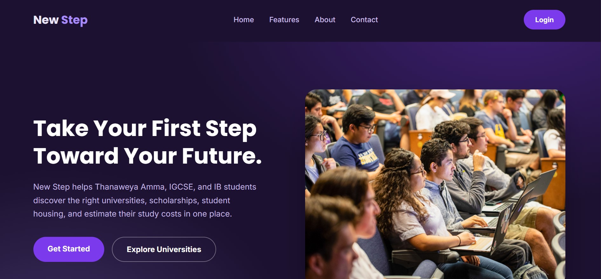
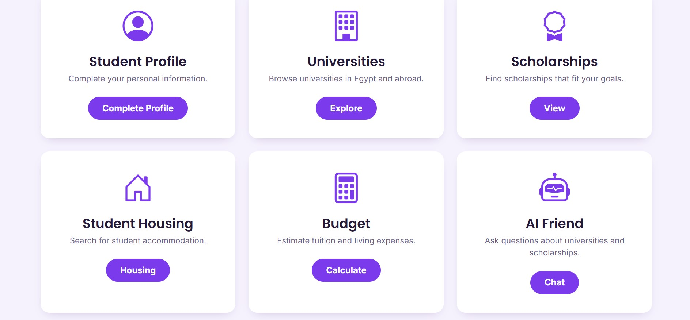
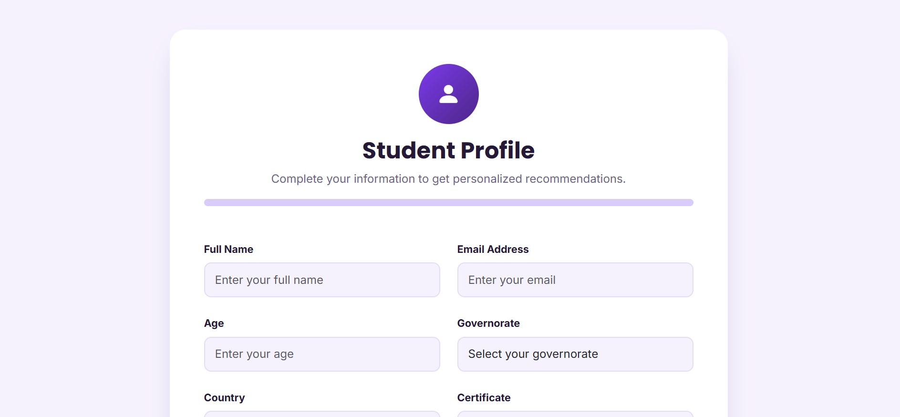
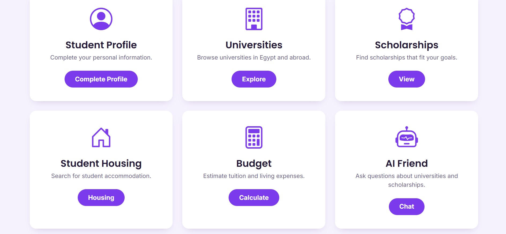
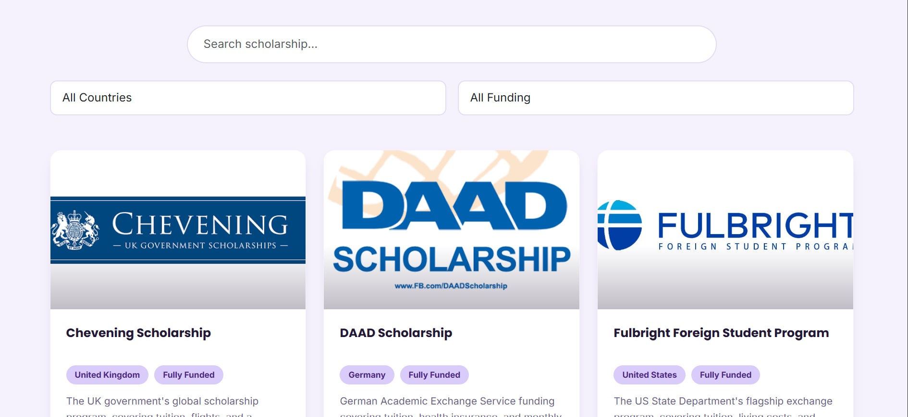
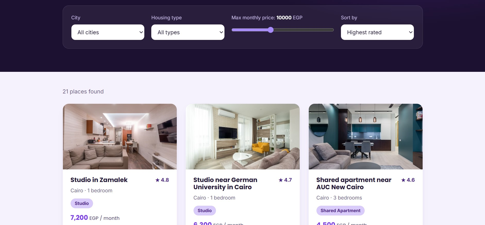
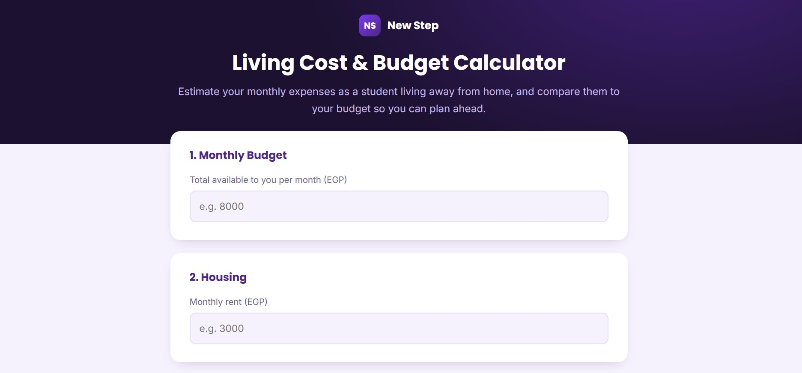
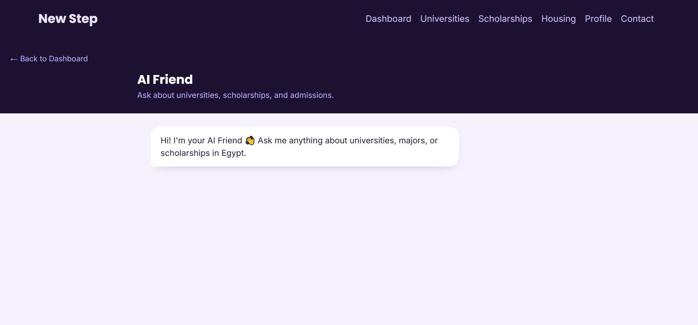

# 🎓 New Step
**"Start Your Journey Towards Your Future."**

New Step is an online platform that assists **Thanaweya Amma, IGCSE, and IB** students in Egypt to get clarity on what to do next: which universities suit their marks and wallet, which scholarships they can get, where to stay as a student, and how much it will cost them — all in one place instead of searching for the information in hundreds of websites and Facebook groups.

 **Live demo link:** https://new-step-ten.vercel.app/
 **Repo link:** https://github.com/ayaelsaiedy2009-design/New-Step

---

## 💡 The reason for creating it
Choosing a university in Egypt after finishing school is a challenging task. Students run from one university website to another, look for relevant scholarships in PDFs and search in Facebook housing groups to do basic comparisons such as price and location. I wanted to create a single place for students where they could create a profile once and after that have access to all corresponding universities, scholarships, and affordable housing options together with a calculator that will show the monthly costs of student life.

✨ Features

Landing page - presents the platform, describes features, contains the about section and the contact form
Authentication — login/register with client-side form validation and smooth transition between both forms
Student Profile — edit personal details, educational background, budget and preferences; the progress will be tracked and saved using the localStorage
Dashboard — welcomes user with personalized greeting, shows statistics, provides quick access to the other parts of the application and daily study tip
Universities Explorer — search by name, use filters according to the country/budget/university type and follow to the modal with more information about the university and the link to its official site
Scholorships Explorer - browse more than 20 international scholarships, filter them by country and funding type and go straight to the official application link
Students Accommodation — find accommodation by city and type, filter it by price and rating, and view additional information in the popup
Budget Calculator — input expenses for rent, electricity, water, internet, gas, food, transport and personal expenses; user will receive instant feedback on whether the expenses fit in traditional expenses of a student
AI Friend (chatbot) — provides answers to frequently asked students' questions regarding universities, scholarships, admission requirements, accommodation and planning of finances

## 📸 Screenshots

### Landing Page

### Student Dashboard

### Student Profile

### Universities Explorer

### Scholarships Explorer

### Student Accommodation

### Budget Calculator

### AI Friend

Tech Stack
HTML5 — structure of pages
CSS3 — styling the pages
JavaScript (ES6) — providing interactivity
Bootstrap 5 + Bootstrap Icons — user interface components and icons
Google Fonts — typography
Local Storage API — storing user profile, settings, and expenses in browser (no back end and database)

No back end, no database, no building — it's a static web site working in a browser and hosted on Vercel.

How It Works
Make a profile: find out you type of certificate (Thanaweya Amma/IGCSE/IB) and your grades and preferences.
Check your possibilities: the app filters the data about universities, scholarships, and housing available according to your profile.
Make budget: the software totals the planned monthly expenditures and compares it with the usual student budget.
Ask your AI Friend: if you are stuck, the chatbot will answer common questions for you instead of googling it yourself.
Make a decision: compare your selected features and make the step forward.
New-Step/
├── index.html           
├── auth.html                   
├── dashboard.html              
├── profile.html                  
├── universities.html        
├── scholarships.html         
├── housing.html                
├── budget.html                 
├── chat.html                    
├── css/
│   └── style.css
└── js/
    ├── auth.js
    ├── dashboard.js
    └── main.js
🚀 To run it locally
No need for any build tools, this is all HTML/CSS/JS:
bash
git clone https://github.com/ayaelsaiedy2009-design/New-Step.git
cd New-Step
# here, just simply open index.html in your browser or have a local server setup:
python3 -m http.server 8000
Then visit http://localhost:8000.
🤖 Use of AI
AI tools were used to help debug, suggest wording, and draft this README. The main structure, features, page structure, and data (universities, scholarships, housing) have been created and written by me.
Credits
Developer: Aya Mohamed
License
This project was created for academic/hackathon purposes